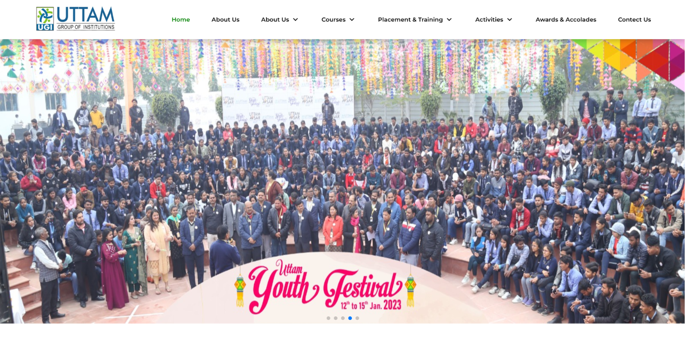

<h1 align="center">🏫 Uttam Group of Institutions </h1>

<p align="center">
  A fully responsive multi-page college website built with <strong>HTML</strong>, <strong>CSS</strong>, and <strong>JavaScript</strong>.
</p>

<p align="center">
  <a href="https://uttamcollege.netlify.app/" target="_blank">
    
  </a>
  
  
  
  
  
</p>

---

## 📸 Screenshot

<p align="center">
  
</p>

---

## 🌟 About

This is the official website of **Uttam Group of Institutions, Agra** — a premier educational institution offering professional courses like MBA, BBA, BCA, B.Sc. Biotechnology, and B.Com.

🔗 **Live Site:** [uttamcollege.netlify.app](https://uttamcollege.netlify.app/)

The website showcases:
- College courses, facilities & placements
- Student alumni messages
- Activities, events & cultural programs
- Campus life and philosophy

---

## ⚙️ Tech Stack

| Technology | Purpose |
|---|---|
| **HTML5** | Structure & Semantic Markup |
| **CSS3** | Styling & Responsive Design |
| **JavaScript** | Interactivity & DOM Manipulation |
| **Swiper.js** | Hero image slider & carousels |
| **Remix Icons** | Navigation & UI icons |
| **Font Awesome** | Social & facility icons |

---

## ✨ Features

- 🖼️ **Auto-play Hero Slider** — Image carousel with Swiper.js
- 📱 **Fully Responsive** — Mobile-friendly with hamburger menu
- 🎓 **Courses Section** — MBA, BBA, BCA, B.Sc. BT, B.Com with details
- 🏢 **Facilities Section** — Medicare, Cafeteria, Library, Smart Classes etc.
- 🎬 **Youth Festival Video** — Embedded college event video
- 💬 **Alumni Messages** — Carousel with student testimonials
- 📜 **Our Philosophy** — YouTube video + college mission
- 📢 **Announcements Ticker** — Scrolling news in footer
- 🔗 **Dropdown Navigation** — Multi-level responsive navbar
- 🌐 **Multi-page Website** — 18+ HTML pages

---

## 📄 Pages

| Page | File | Description |
|---|---|---|
| 🏠 Home | `index.html` | Main landing page with all sections |
| ℹ️ About Us | `about.html` | College overview |
| 🎯 Vision & Mission | `Vision-&-Mission.html` | College values |
| 🎓 MBA | `mba.html` | MBA course details |
| 🎓 BBA | `bba.html` | BBA course details |
| 🎓 BCA | `bca.html` | BCA course details |
| 🔬 B.Sc. Biotech | `biotech.html` | Biotechnology course |
| 📊 B.Com | `b.com.html` | Commerce course |
| 💼 Campus Placement | `campus-Placement.html` | Placement info |
| 🏢 Campus to Corporate | `campus-To-Corporate.html` | Training program |
| 🎤 Guest Lectures | `Guest-Lectures.html` | Guest speaker events |
| 🎪 Avsar | `avsar.html` | Mega Job Fair Series |
| 🏭 Industry Visits | `Industry-Visits.html` | Industrial exposure |
| 🛠️ Workshops & Seminars | `Workshops-&-Seminars.html` | Academic events |
| 🎭 Cultural Activities | `Cultural-Activities.html` | Cultural programs |
| 🏆 Annual Fest | `Annual-Fest.html` | College annual fest |
| 📋 Management Activities | `Management-Activities.html` | Management events |
| 🥇 Awards & Accolades | `Awards-&-Accolades.html` | College achievements |

---

## 📁 Project Structure

```
uttam_college-main/
├── index.html                    # Home page
├── about.html                    # About page
├── mba.html / bba.html / bca.html # Course pages
├── biotech.html / b.com.html     # Course pages
├── campus-Placement.html         # Placement page
├── ...                           # Other pages (18+ total)
│
├── css/
│   ├── style.css                 # Main stylesheet
│   ├── about.css
│   ├── mba.css / bba.css / bca.css
│   └── ...                       # Page-specific styles
│
├── js/
│   ├── main.js                   # Main JavaScript
│   └── student.js                # Alumni carousel logic
│
├── images/
│   ├── hero/                     # Hero slider images
│   ├── Courses/                  # Course images
│   ├── topper/                   # Alumni photos
│   ├── logo/                     # College logo
│   ├── fest.mp4                  # Youth festival video
│   └── ...                       # Other assets
│
└── screenshots/
    └── home.png                  # Website screenshot
```

---

## 🚀 Getting Started

No build tools required! Simply open in browser:

```bash
# Clone the repository
git clone https://github.com/ritikvarun/uttam_college.git

# Navigate to project
cd uttam_college-main

# Open in browser
start index.html
```

Or use **Live Server** extension in VS Code for best experience. ✅

---

## 📬 Contact — Uttam Group of Institutions

| | Details |
|---|---|
| 📞 Phone | +91-8171400500 / 9997434531 |
| 🌐 Website | [www.uttaminstitute.ac.in](http://www.uttaminstitute.ac.in) |
| 📍 Campus | U.G.I. Campus, Runakata, Agra |
| 🏙️ City Office | Uttam Info Center, Hari Parvat Crossing, Agra |

---

<p align="center">
  Made with ❤️ by <strong>Ritik Varun</strong>
  <br/>
  ⭐ <em>If you liked this project, please give it a star!</em>
</p>
